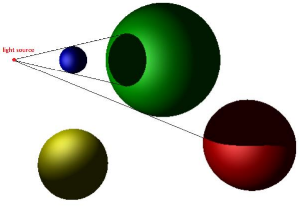
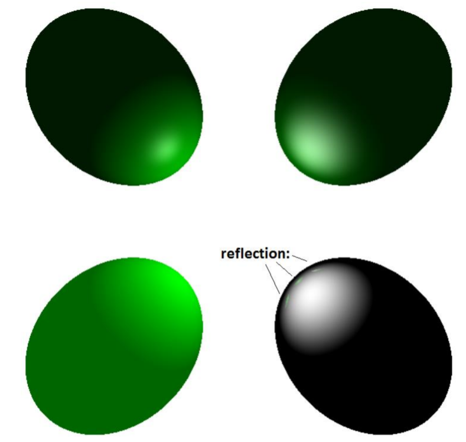

# Distributed Ray Tracer tool with C++ and MPI

This project uses C++ with MPI to display a Ray Tracer image according to Phong's ilumination model and calculated in a distributed fashion. 
Additionally, it uses the OpenCV library to plot the images.

To choose a desired plotting situation, it suffices to change the camera, scene and lightSource functions at the main.cpp file (the ones currently written at the code serve as an example). It is possible to change the colour, geometry and Phong's ilumination coeficients of objects, the position and orientation of the camera, and the position, colour and orientation of the light source, as specified in the respective header files of objects, the scene, lightSource and camera.

General documentation is provided in the header files. 
Low-level documentation of the main core of performed calculations is provided in the Ray.cpp file.

Some basic examples of drawn images:

Basic geometry test:

Basic reflection test on different Phong's coefficients:

